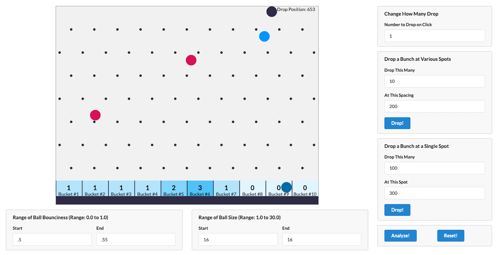
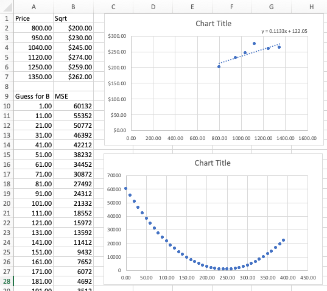

# Machine Learning with Javascript

Machine Learning with Javascript by Stephen Grider

## Folder structure

- ../resources
  - MLKits - starter kits
  - MLCasts - complete code
- 01-introduction
  - plinko
- 02-algorithm
  - plinko : using lodash
  - `node index.js`
- 03-tensorflow: tensorflow features for house price project
- 04-tf-app
  - knn-tf-house-price: house price
- 14-loadcsv
  - loadcsv: csv loading project

## Details

<details open>
  <summary>Click to Contract/Expend</summary>

## Section 1: What is Machine Learning?

### 5. A Complete Walkthrough

#### Problem solving process

1. Identify the independent and dependent variables
   - `Features` are categories of data points that affect the value of a `label`
1. Assemble a set of data related to the problem you're trying to solve
   - Datasets almost always cleanup of formatting
1. Decide on the type of output you are predicting
   - `Regression` used with continuous values, classification used with descrete values
1. Based on type of output, pick an algorithm that will determine a correlation between your `features` and `labels`
   - Many, many different algorithms exist, each with pros and cons
1. Use model generated by algorithm to make a prediction
   - Models relate the value of `features` to the value of `labels`

#### Methods

1. Classification : fewer or two options
   - The value of our labels belong to a discrete set
2. Regression : Arrange
   - The value of our labels belong to a continuous set

### 8. Identifying Relevant Data



| Feature         | Column                 |
| --------------- | ---------------------- |
| Drop Position   | Bucket a ball lands in |
| Ball Bounciness |                        |
| Ball Size       |                        |

> Change one of Features -> Will probably change Column

### 11. What Type of Problem?

- we choose `Classification` -> Bucket #1 ~ #10
- Algorithm: K-Nearest Neighbor (knn)
  - "Birds of a feather flock together"

### 12. How K-Nearest Neighbor Works

N-Nearest Neighbor (with one independent variable)

### 13. Lodash Review

[lodash doc](https://lodash.com/docs)

### 17. Interpreting Bad Results

1. Adjust the parameters of the analysis
   `const k = 3;`
2. Add more features to explain the analysis
3. Change the prediction point
4. Accept that maybe there isn't a good correlation

### 25. Updating KNN for Multiple Features

Start "2. Add more features to explain the analysis"

Pythagorean Theorem : a^2 + b^2 = c^2

### 26. Multi-Dimensional KNN

Pythagorean Theorem \
`C = (A ** 2 + B ** 2) ** 0.5`

```js
const outputs = [
  [40, 0.5, 16, 1],
  [150, 0.52, 16, 2],
  [350, 0.55, 16, 2],
  [425, 0.53, 16, 3]
];
const target = [323, 0.52, 16, 2];

C ** 2 = A ** 2 + B ** 2
C = (A ** 2 + B ** 2) ** 0.5
C = ((350 - 323) ** 2) + ((0.55 - 0.52) ** 2) ** 0.5
```

3D Pythagorean Theorem : a^2 + b^2 = c^2
`D = (A ** 2 + B ** 2 + C ** 2) ** 0.5`

### 30. Feature Normalization

`Normalized Dataset = (FeatureValue - min) / (max - min)`

### 33. Feature Selection with KNN

Not all features give us a good guess. \
Some features are not giving us good accuracy

### 35. Evaluating Different Feature Values

```js
the length of data:  1596
score.js:47 For feature of 0 accuracy: 0.32
score.js:47 For feature of 1 accuracy: 0.15
score.js:47 For feature of 2 accuracy: 0.03
```

dropPosition is a good selection feature \
bounciness and size are not

## Section 3: Onwards to Tensorflow JS!

### 36. Let's Get Our Bearings

- Features vs Labels
- Test vs Trainnig sets of data
- Feature Normalization
- Common data structures (arrays of arrays)
- Feature Selection

#### Lodash

- Pros
  - Methods for just about everything we need
  - Excellent API design (especially chain!)
  - Skills transferrable to other JS projects
- Cons
  - Extremely slow (relatively)
  - Not 'numbers' focused
  - Some things are awkward (getting a column of values)

#### Tensorflow JS

- Pros
  - Similar API to Lodash
  - Extremely fast for numeric calculations
  - Has a 'low level' linear algebra API + higher level API for ML
  - Similar api to numpy - popular Python numerical lib
- Cons
  - Still in active development

### 38. Tensor Shape and Dimension

[TesorFlow.js Doc](https://js.tensorflow.org/api/4.0.0/)

- `[]` : 1 Dimentional
- `[[]]` : 2 Dimentional
- `[[[]]]` : 3 Dimentional

#### Shape

```js
// 1 dimentional
[5, 10, 17].length -> [3] shape

// 2 dimentional
[
  [5, 10, 17],
  [5, 10, 17].length,
].length -> [2, 3] shape

// 3 dimentional
[
  [
    [5, 10, 17].length,
  ].length
].length -> [1, 1, 3] shape
```

> 2D is the most important dimention we will work with \
> [# rows, # columns] -> [2, 3]

### 41. Broadcasting Operations

Brodcasting works when

- Take shape of both tensor -> From right to left, the shapes are equal or one is '1'

- Shape[3] and Shape[1] => O
  - [3]
  - [1]
- Shape[2, 3] and Shape [2, 1] => O
  - [2, 3]
  - [2, 1]
- Shape[2, 3, 2] and Shape [3, 1] => O
  - [2, 3, 2]
  - [ , 3, 1]
- Shape[2, 3, 2] and Shape [2, 1] => X
  - [2, 3, 2]
  - [ , 2, 1]

## Section 4: Applications of Tensorflow

### 49. KNN with Regression

- Which bucket will a ball go into? -> Classification
- What is the price of a house? -> Regressions

#### KNN Algorithm

- Find distance between features and prediction point
- Sort from lowest point to greatest
- Take the top K records
- Average the label value of those top K records

### 50. A Change in Data Structure

#### Differences between plinko and house-price

```js
// plinko
// features and bucket were in the same structure
[
  [350, 0.55, 16, 2],
  [350, 0.55, 16, 2]
];

// house-price
// features and labels are separated
const features = [
  [84, 83],
  [84.1, 85]
];
const housePrice = [[200], [250]];
```

### 51. KNN with Tensorflow

distance = ((lon - lon) ** 2 + (lat - lat) ** 2) \*\* 0.5

### 53. Sorting Tensors

- [tf.unstack](https://js.tensorflow.org/api/latest/?utm_source=www.tensorflow.org&utm_medium=referral&_gl=1*d01f2p*_ga*NDQxMTA5NTQ4LjE2NzA2MjMzMzQ.*_ga_W0YLR4190T*MTY3MDkxMjgzMi40LjEuMTY3MDkxMjgzMy4wLjAuMA..#unstack)
- make the tensor data to a normal javascript array

### 55. Moving to the Editor

```sh
npm install --save @tensorflow/tfjs-node lodash shuffle-seed
```

### 58. Reporting Error Percentages

Initial analysis

```sh
Error: 15% Guess: 925420 , Expected 1085000
Error: -36% Guess: 636235 , Expected 466800
Error: -11% Guess: 472810 , Expected 425000
Error: -23% Guess: 695514.3 , Expected 565000
Error: 21% Guess: 600730 , Expected 759000
Error: -12% Guess: 573287.2 , Expected 512031
Error: -1% Guess: 773849.5 , Expected 768000
Error: 75% Guess: 381626.2 , Expected 1532500
Error: -199% Guess: 613175 , Expected 204950
Error: -71% Guess: 423569.9 , Expected 247000
```

### 59. Normalization or Standardization?

for exmaple, if one value is extremely high or low \
Normalization wouldn't mean much. \
Then standardization would be a better option

### 60. Numerical Standardization with Tensorflow

(Value - Aaverage) / StandardDeviation

StandardDeviation = sqrt(variance)\
StandardDeviation = variance \*\* 0.5

### 61. Applying Standardization

```sh
# dataColumns: ['lat', 'long', 'sqft_lot'],
Error: -15% Guess: 1245050 , Expected 1085000
Error: -64% Guess: 765837.1 , Expected 466800
Error: -100% Guess: 848675 , Expected 425000
Error: -38% Guess: 781742 , Expected 565000
Error: -3% Guess: 781470 , Expected 759000
Error: 0% Guess: 514000 , Expected 512031
Error: -6% Guess: 814785 , Expected 768000
Error: 49% Guess: 774700 , Expected 1532500
Error: -19% Guess: 243402.5 , Expected 204950
Error: 2% Guess: 242865 , Expected 247000
```

### 62. Debugging Calculations

```sh
node --inspect-brk index.js
```

And navigate `about:inspect` on the browser\

We can inspect the code using breaking points and console

```js
features.sub(mean).div(variance.pow(0.5)).print();
features
  .sub(mean)
  .div(variance.pow(0.5))
  // .sub(predictionPoint)
  .sub(scaledPrediction)
  .pow(2)
  .sum(1)
  .pow(0.5)
  .print();
```

### 63. What Now?

```sh
# tremendous improvement!
# dataColumns: ['lat', 'long', 'sqft_lot', 'sqft_living'],
node index.js
Error: -15% Guess: 1251260 , Expected 1085000
Error: -11% Guess: 519756.5 , Expected 466800
Error: -2% Guess: 433700 , Expected 425000
Error: 19% Guess: 455800 , Expected 565000
Error: 8% Guess: 699750 , Expected 759000
Error: -14% Guess: 584260 , Expected 512031
Error: -9% Guess: 835450 , Expected 768000
Error: 13% Guess: 1329790 , Expected 1532500
Error: -36% Guess: 279422.5 , Expected 204950
Error: 7% Guess: 228767.5 , Expected 247000
```

## Section 5: Getting Started with Gradient Descent

### 64. Linear Regression

- Pros
  - Fast! Only train one time, then use for any prediction
  - Uses methods that will be very important in more complicated ML
- Cons
  - Lot harder to understand intuitively

### 65. Why Linear Regression?

`price = 200 * Lot Size + 3000`

#### in Google doc,

you can create a chart and add a trend line based on the base (Use Equiation)\
But that's for only one independent variable - dependent variable

> With linear regression, we can use arbitrary numbers of independent variable to one output

### 66. Understanding Gradient Descent

#### Methods of Solving linear regression

- Ordinary Least Squares
- Generalized Least Squares
- ...others
- Gradient Descent

#### Mean Squared Error (MSE)


- \mathrm{MSE} = mean squared error
- {n} = number of data points
- Y\_{i} = observed values
- \hat{Y}\_{i} = predicted values

#### Let's guess

- bad guess: `y = 0x + 1`
- How wrong were we?
  - Mean Squared Error
    - `((1-200)**2 + (1-230)**2 + (1-245)**2 + (1-274)**2 + (1-259)**2 + (1-262)**2) / 6`
    - 360792 / 6 = 60132
- better guess: `y = 0x + 200`
  - Mean Squared Error
    - `((200-200)**2 + (200-230)**2 + (200-245)**2 + (200-274)**2 + (200-259)**2 + (200-262)**2) / 6`
    - 15726 / 6 = 2621

#### What's a good guess?

- `Price = m * Lot Size + b`
- 'm' and 'b' will be as correct as they can be when MSE is as low as possible

### 67. Guessing Coefficients with MSE


[MSE graph.xlsx](./resources/mse_graph.xlsx)

> We need to find the lowerest MSE

#### Issues with this approach

- - `Price = m * Lot Size + b`
- Don't know the possible range of b
- Don't know a step size for incrementing b
- Huge computational demands when adding in more features

### 69. Derivatives!

- [Wolfram Alpha - Computational Intelligence](https://www.wolframalpha.com/)
- `y = x^2 + 5`
  
- search `derivative x^2 + 5` \
  
- `derivative x^2 + 5`: y value means slope
  

### 70. Gradient Descent in Action

1. Pick a value for 'b'
2. Calculate the slope of MSE with b : derivative
3. Is the slope very, very small? If yes, we are done!
4. Multiply the slope by an arbitrary small value called a 'learning rate'
5. Subtract that from 'b'
   - Go back to 2

### 72. Why a Learning Rate?

[[Gradient Descent] Sheet on MSE graph.xlsx](./resources/mse_graph.xlsx)

### 73. Answering Common Questions

- Why worry about derivatives? Just calculate MSE twice and compare the two values
  - by `Slope of MSE` is already doing that calculation
- We want slope of 0, so why not set the derivative equial to 0 and solve for b?

### 74. Gradient Descent with Multiple Terms

1. Pick a value for 'b' and 'm'
2. Calculate the slope of MSE with respect to 'm' and 'b': derivative
3. Is the slope very, very small? If yes, we are done!
4. Multiply the slope by an arbitrary small value called a 'learning rate'
5. Subtract that from 'b' and 'm'
   - Go back to 2

</details>

## Tips

- Node js debugging using chrome:
  - `node --inspect-brk index.js`
  - navigate `about:inspect`
