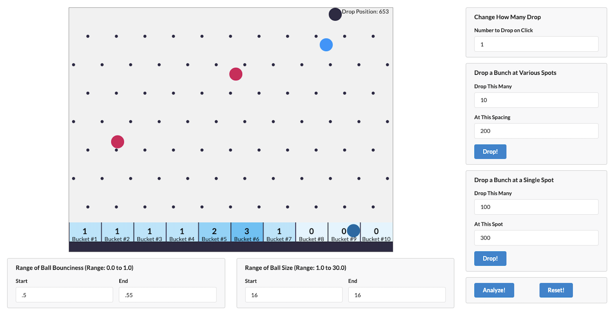

# Machine Learning with Javascript

Machine Learning with Javascript by Stephen Grider

## Folder structure

- ../resources
  - MLKits - starter kits
  - MLCasts - complete code
- 01-introduction
  - plinko

## Details

<details open>
  <summary>Click to Contract/Expend</summary>

## Section 1: What is Machine Learning?

### 5. A Complete Walkthrough

#### Problem solving process

1. Identify the independent and dependent variables
   - `Features` are categories of data points that affect the value of a `label`
1. Assemble a set of data related to the problem you're trying to solve
   - Datasets almost always cleanup of formatting
1. Decide on the type of output you are predicting
   - `Regression` used with continuous values, classification used with descrete values
1. Based on type of output, pick an algorithm that will determine a correlation between your `features` and `labels`
   - Many, many different algorithms exist, each with pros and cons
1. Use model generated by algorithm to make a prediction
   - Models relate the value of `features` to the value of `labels`

#### Methods

1. Classification : fewer or two options
   - The value of our labels belong to a discrete set
2. Regression : Arrange
   - The value of our labels belong to a continuous set

### 8. Identifying Relevant Data



| Feature         | Column                 |
| --------------- | ---------------------- |
| Drop Position   | Bucket a ball lands in |
| Ball Bounciness |                        |
| Ball Size       |                        |

> Change one of Features -> Will probably change Column

### 11. What Type of Problem?

- we choose `Classification` -> Bucket #1 ~ #10
- Algorithm: K-Nearest Neighbor (knn)
  - "Birds of a feather flock together"

### 12. How K-Nearest Neighbor Works

N-Nearest Neighbor (with one independent variable)

### 13. Lodash Review

[lodash doc](https://lodash.com/docs)

### 17. Interpreting Bad Results

1. Adjust the parameters of the analysis
   `const k = 3;`
2. Add more features to explain the analysis
3. Change the prediction point
4. Accept that maybe there isn't a good correlation

### 25. Updating KNN for Multiple Features

Start "2. Add more features to explain the analysis"

Pythagorean Theorem : a^2 + b^2 = c^2

### 26. Multi-Dimensional KNN

Pythagorean Theorem \
`C = (A ** 2 + B ** 2) ** 0.5`

```js
const outputs = [
  [40, 0.5, 16, 1],
  [150, 0.52, 16, 2],
  [350, 0.55, 16, 2],
  [425, 0.53, 16, 3]
];
const target = [323, 0.52, 16, 2];

C ** 2 = A ** 2 + B ** 2
C = (A ** 2 + B ** 2) ** 0.5
C = ((350 - 323) ** 2) + ((0.55 - 0.52) ** 2) ** 0.5
```

3D Pythagorean Theorem : a^2 + b^2 = c^2
`D = (A ** 2 + B ** 2 + C ** 2) ** 0.5`

### 30. Feature Normalization

`Normalized Dataset = (FeatureValue - min) / (max - min)`

### 33. Feature Selection with KNN

Not all features give us a good guess. \
Some features are not giving us good accuracy

### 35. Evaluating Different Feature Values

```js
the length of data:  1596
score.js:47 For feature of 0 accuracy: 0.32
score.js:47 For feature of 1 accuracy: 0.15
score.js:47 For feature of 2 accuracy: 0.03
```

dropPosition is a good selection feature \
bounciness and size are not

</details>
